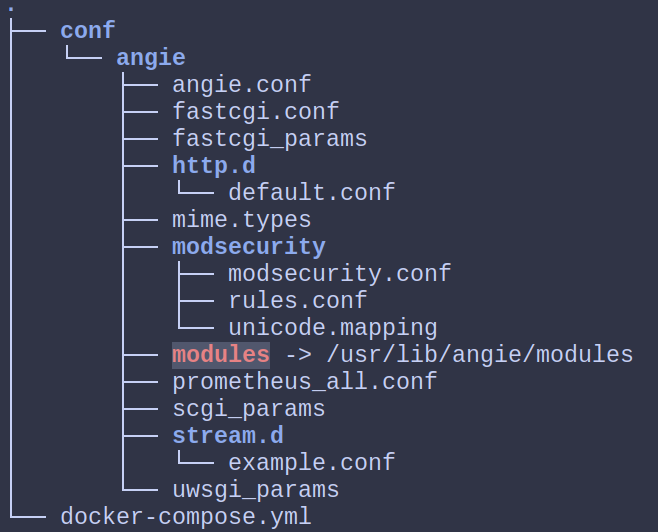
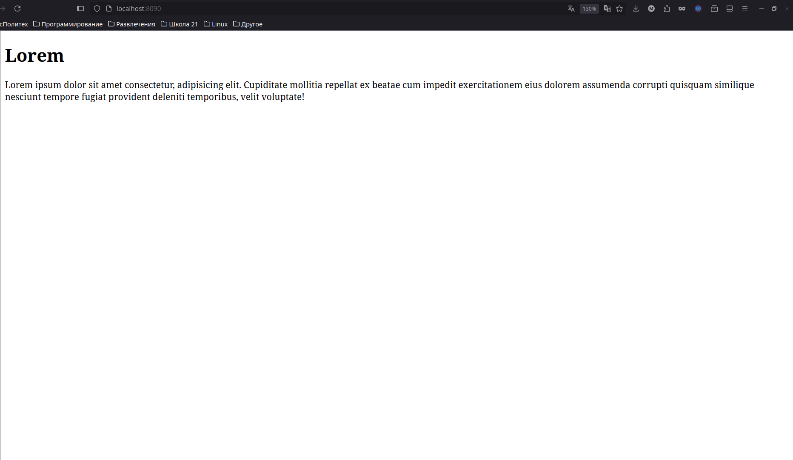

# Знакомство с Angie

1. Создаем папку проекта
2. В ней пишем docker-compose файл:

   ```yml
   services:
     angie:
       image: docker.angie.software/angie:latest
       hostname: angie
       # volumes:
       # - var/www:/usr/share/angie/html:ro
       # - conf/angie/angie.conf:/etc/angie/angie.conf:ro
   ```

> Что здесь происходит
>
> - добавляем вольюмы для того, что при перезапуске композ файла важные данные не сбрасывались
> - до первого двоеточия идет локальный путь `var/www`, а после - путь внутри контейнера `/usr/share/angie/html`. После второго двоеточия идет режим. В данном случае используется Read Only (ro).

3. Далее применяем команду:

   ```sh
   docker compose run --rm -it angie ash
   ```

4. Далее нужно себе из контейнера скопировать файл с конфигом angie

   ```sh
   docker cp <container_name>:/etc/angie conf
   ```

5. После этого переименовываем скопированную папку `conf` в `angie`, создаем папку `conf`, а после папку `angie` перемещаем в папку `conf`.

   ```sh
   mv angie conf
   mkdir conf
   sudo chown -R <имя пользователя>:<имя группы> angie/
   mv angie conf
   ```

6. Должна получиться такая структура:
   

7. Далее изучаем конфиги

   1. Начинаем с `angie.conf`:

      ```
      user  angie;
      worker_processes  auto;
      # кол-во файлов, кторое может открывать один процесс
      worker_rlimit_nofile 65536;

      # Путь к файлу лога ошибок
      error_log  /var/log/angie/error.log notice;
      # Номер процесса веб-сервера
      pid        /run/angie/angie.pid;

      # максимальное кол-во параллельных соединений, которое открыть воркер
      # Воркер - это дочерний процесс angie
      events {
          worker_connections  65536;
      }


      http {
          include       /etc/angie/mime.types;
          default_type  application/octet-stream;

      	# Форматы для описания логов
          log_format  main  '$remote_addr - $remote_user [$time_local] "$request" '
                            '$status $body_bytes_sent "$http_referer" '
                            '"$http_user_agent" "$http_x_forwarded_for"';

          log_format extended '$remote_addr - $remote_user [$time_local] "$request" '
                              '$status $body_bytes_sent "$http_referer" rt="$request_time" '
                              '"$http_user_agent" "$http_x_forwarded_for" '
                              'h="$host" sn="$server_name" ru="$request_uri" u="$uri" '
                              'ucs="$upstream_cache_status" ua="$upstream_addr" us="$upstream_status" '
                              'uct="$upstream_connect_time" urt="$upstream_response_time"';

      	# Лог для успешных запросов пользователя
          access_log  /var/log/angie/access.log  main;

      	# Фича ядра линуха, чтобы очень легко и быстро передавать бинарные файлы по tcp
          sendfile        on;

          # Настройка для производительности принятия tcp соединений
          #tcp_nopush     on;

      	# Сколько секунд серевер будет продолжать работать при отсутствии запросов
          keepalive_timeout  65;

      	# Включено ли сжатие данных при передаче через http
          #gzip  on;

      	# Подгружает конфиги других сайтов
          include /etc/angie/http.d/*.conf;
      }

      #stream {
      #    include /etc/angie/stream.d/*.conf;
      #}

      ```

   2. Затем `./conf/angie/http.d/default.conf`

8. После этого правим докер-композ файл:

   ```yml
   services:
     angie:
       image: docker.angie.software/angie:latest
       hostname: angie
       ports:
         - 8080:80
       volumes:
         - ./www:/usr/share/angie/html:ro
         - ./conf/angie/:/etc/angie:ro
   ```

9. После чего выполняем `docker compose up -d`
10. После чего переходим по адресу http://localhost:8080/ в браузере
11. Подключиться к запущенному контейнеру можно с помощью команды:

    ```sh
    docker exec -it angie_practice-angie-1 ash
    ```

12. Далее создаем папку `www` и в ней создаем файл `index.html`

    ```html
    <!DOCTYPE html>
    <html lang="en">
      <head>
        <meta charset="UTF-8" />
        <meta name="viewport" content="width=device-width, initial-scale=1.0" />
        <title>Document</title>
      </head>

      <body>
        <h1>Lorem</h1>
        <p>
          Lorem ipsum dolor sit amet consectetur, adipisicing elit. Cupiditate
          mollitia repellat ex beatae cum impedit exercitationem eius dolorem
          assumenda corrupti quisquam similique nesciunt tempore fugiat
          provident deleniti temporibus, velit voluptate!
        </p>
      </body>
    </html>
    ```

13. Остается только запустить проект с помощью команды ниже и перейти в браузере по адресу `http://localhost:8090/`
    ```
    docker-compose up -d
    ```
14. Получаем следующий результат:
    
