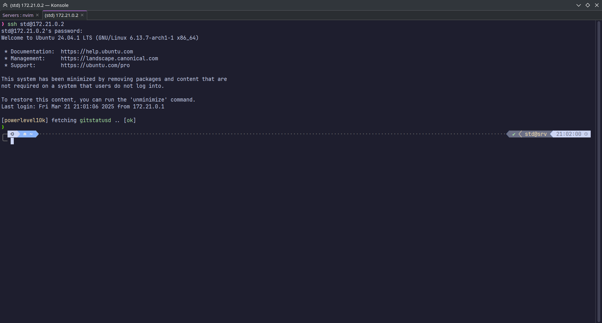

# Знакомство с Ansible

1. Подключаемся к хостингу политеха через консоль
2. Создать новую папку для выполнение лр
   ```
   mkdir ansible-practice
   ```
3. Переходим в созданную папку
4. Установить ansible внутри заранее созданного виртуального окружения python: `pip install ansible`
5. Устанавливаем образ Ubuntu для докера:
   ```sh
   docker pull ubuntu
   ```
6. Создаем новую папку `docker` и в ней создаем новый докер-файл :

   ```dockerfile
   FROM ubuntu

   ENV SSH_USERNAME=std

   RUN apt update && \
       apt install -y openssh-server sudo git

   RUN mkdir -p /run/sshd && \
       chmod 755 /run/sshd

   RUN useradd -m -G sudo -s /bin/bash $SSH_USERNAME && \
       echo "$SSH_USERNAME:$SSH_USERNAME" | chpasswd

   CMD ["/usr/sbin/sshd", "-D"]
   ```

7. Создаем новый `docker-compose.yml`:
   ```yml
   services:
     srv:
       build: docker
       hostname: srv
   ```
8. Поднимаем контейнер:
   ```sh
   docker compose up -d
   ```
9. Узнаем его IP адрес для внесения в inventory.yml:
   ```sh
   docker inspect -f '{{range.NetworkSettings.Networks}}{{.IPAddress}}{{end}}' ansible_practice-srv-1
   ```
10. Подключиться к терминалу созданного контейнера через SSH можно с помощью следующей команды (пароль: std) (ip-может отличаться):
    ```sh
    ssh std@<ip контейнера>
    ```
11. Далее нужно вернуться к папке ansible и создать там новый файл `inventory.yml`:
    ```yml
    myhosts:
      hosts:
        srv:
          ansible_host: <ip контейнера>
          ansible_user: std
    ```
12. Далее нужно создать новый файл `playbook.yml`:

    ```yml
    - name: My first play
      hosts: myhosts
      tasks:
        - name: Ping my hosts
          ansible.builtin.ping:

        - name: Print message
          ansible.builtin.debug:
            msg: Hello world
    ```

13. Нужно установить пакет `sshpass` для того, чтобы можно было не вводить пароль при попытке подключения.
14. Далее для проверки пишем команду:

    ```sh
    ansible-playbook -i inventory.yml --ask-pass playbook.yml
    ```

15. Далее переименуем файл playbook.yml в test_playbook.yml
16. Далее создаем серию каталогов `./roles/common/tasks`
17. Там создаем файл `main.yml`:

    ```yaml
    - name: Install packages
      become: true
      ansible.builtin.apt:
      name: - zsh
      state: present

    - name: Oh My Zsh!
      ansible.builtin.git:
      repo: 'https://github.com/ohmyzsh/ohmyzsh.git'
      dest: ~/.oh-my-zsh

    - name: Get stats of a .zshrc
      ansible.builtin.stat:
      path: ~/.zshrc
      register: zshrc_stat

    - name: Create .zshrc
      ansible.builtin.copy:
      src: ./.oh-my-zsh/templates/zshrc.zsh-template
      dest: ./.zshrc
      remote_src: yes
      when: not zshrc_stat.stat.exists

    - name: Powerlevel10k
      ansible.builtin.git:
      repo: 'https://github.com/romkatv/powerlevel10k.git'
      dest: ~/.oh-my-zsh/custom/themes/powerlevel10k

    - name: Set Theme for Oh My Zsh!
      ansible.builtin.lineinfile:
      path: ~/.zshrc
      regexp: '^ZSH_THEME='
      line: ZSH_THEME="powerlevel10k/powerlevel10k"

    - name: Add source for powerlevel10k in .zshrc
      ansible.builtin.lineinfile:
      path: ~/.zshrc
      regexp: 'source ~/\.p10k.zsh'
      line: "[[! -f ~/.p10k.zsh]] || source ~/.p10k.zsh"

    - name: Copy config for powerlevel10k
      ansible.builtin.copy:
      src: ./.p10k.zsh
      dest: ~/.p10k.zsh

    - name: Install highlight for Oh My ZSH
      ansible.builtin.git:
      repo: 'https://github.com/zsh-users/zsh-syntax-highlighting.git'
      dest: ~/.oh-my-zsh/custom/plugins/zsh-syntax-highlighting

    - name: Install autocomplite for Oh My ZSH
      ansible.builtin.git:
      repo: 'https://github.com/zsh-users/zsh-autosuggestions'
      dest: ~/.oh-my-zsh/custom/plugins/zsh-autosuggestions

    - name: Turn on plugins for Oh My ZSH
      ansible.builtin.lineinfile:
      path: ~/.zshrc
      regexp: '^plugins='
      line: plugins=(git zsh-syntax-highlighting zsh-autosuggestions)

    - name: Change default shell for user
      become: true
      ansible.builtin.user:
      name: std
      shell: /usr/bin/zsh

    ```

18. Для корректной работы стоит добавить в ту же папку файл с уже настроенной темой powerlevel10k. Он должен называться `.p10k.zsh`
19. Возможно для успешного подключения к серверу нужно будет выполнить команду: `ssh-keygen -f /home/username/.ssh/known_hosts -R <ip контейнера>`
20. Создаем в корневой папке файл `playbook-common.yml`:

    ```yml
    - hosts: myhosts
      roles:
        - common
    ```

21. После этого нужно применить созданные playbook:

    ```sh
    ansible-playbook -i inventory.yml --ask-pass --ask-become-pass playbook-common.yml
    ```

22. Если все было сделано правильно, то при первом подключении к терминалу созданного контейнера после настройки будет получен вот такой результат:
    
