# Сбор информации об операционной системе

Функция просмотра пакетов работает только для дистрибутивов с пакетным менеджером pacman.

1. Меню выбора действия
   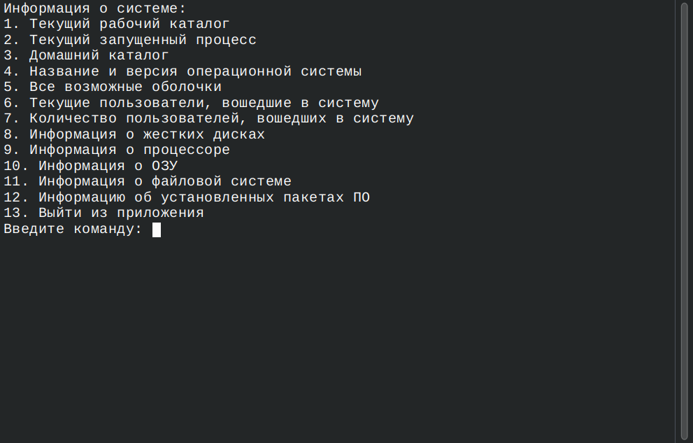
2. Текущий рабочий каталог
   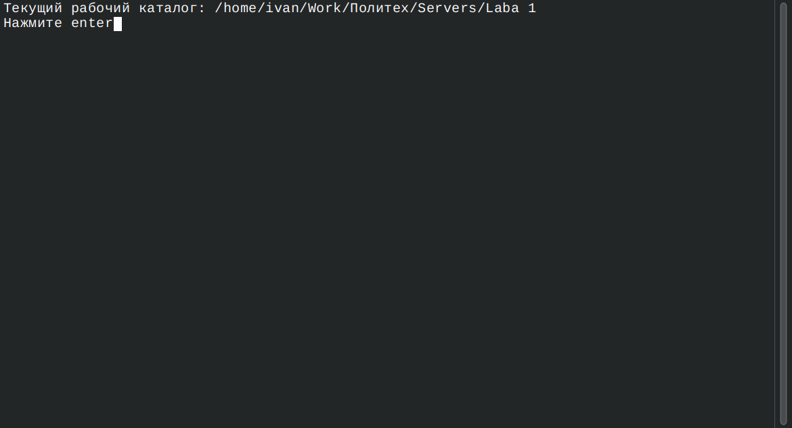
3. Текущий запущенный процесс
   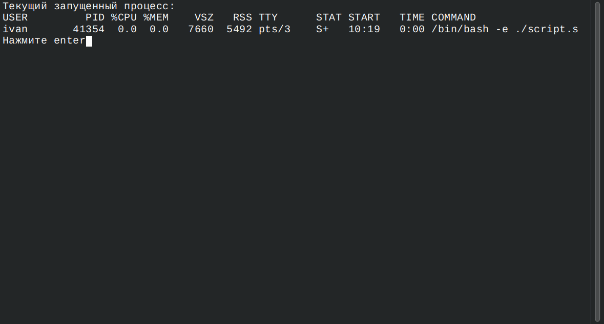
4. Домашний каталог пользователя
   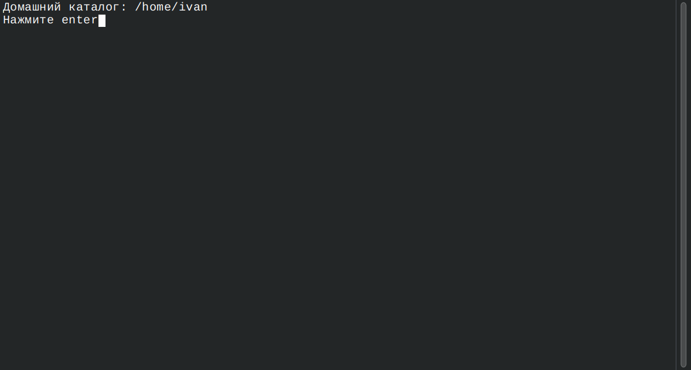
5. Информация о операционной системе
   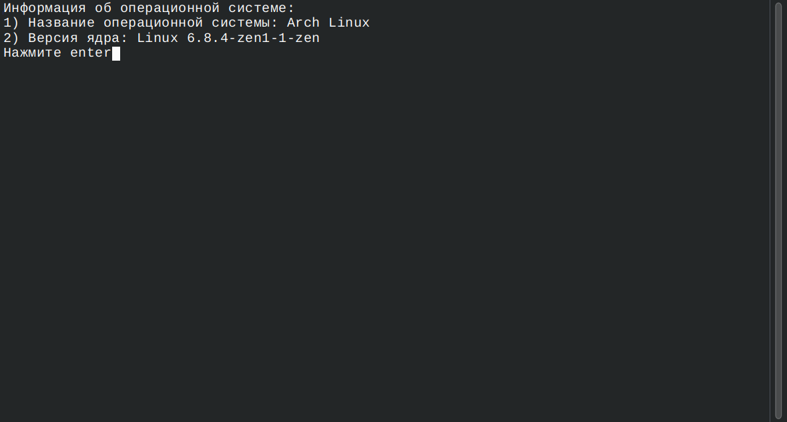
6. Доступные оболочки терминала
   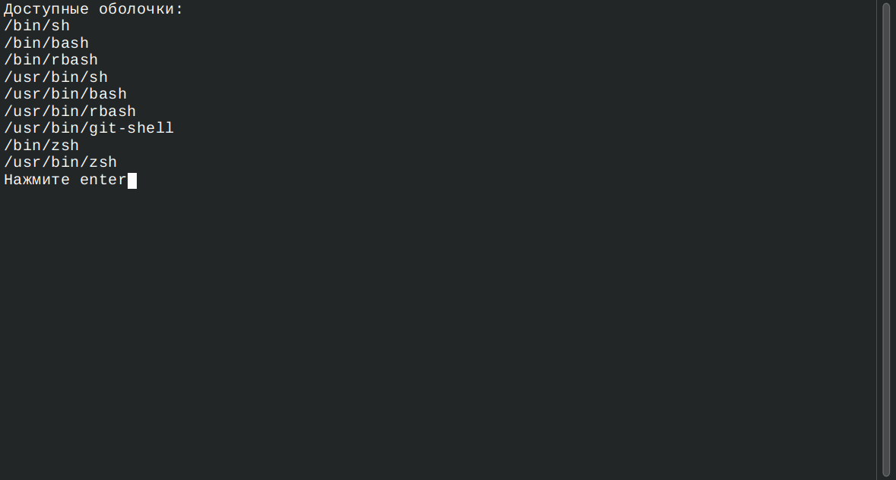
7. Пользователи, работающие в системе на данный момент
   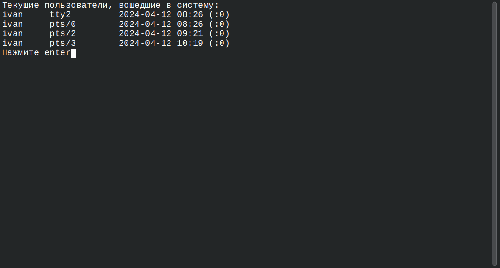
8. Количество пользователей, работающих в системе сейчас
   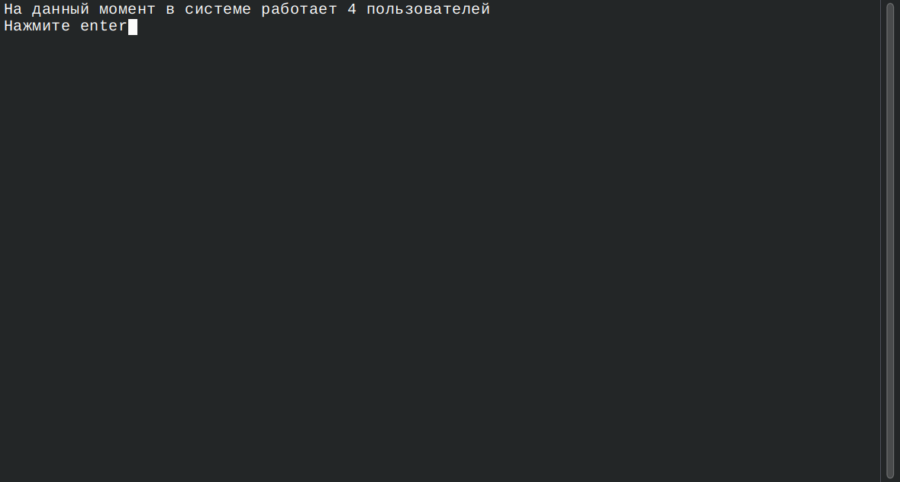
9. Информация о дисках
   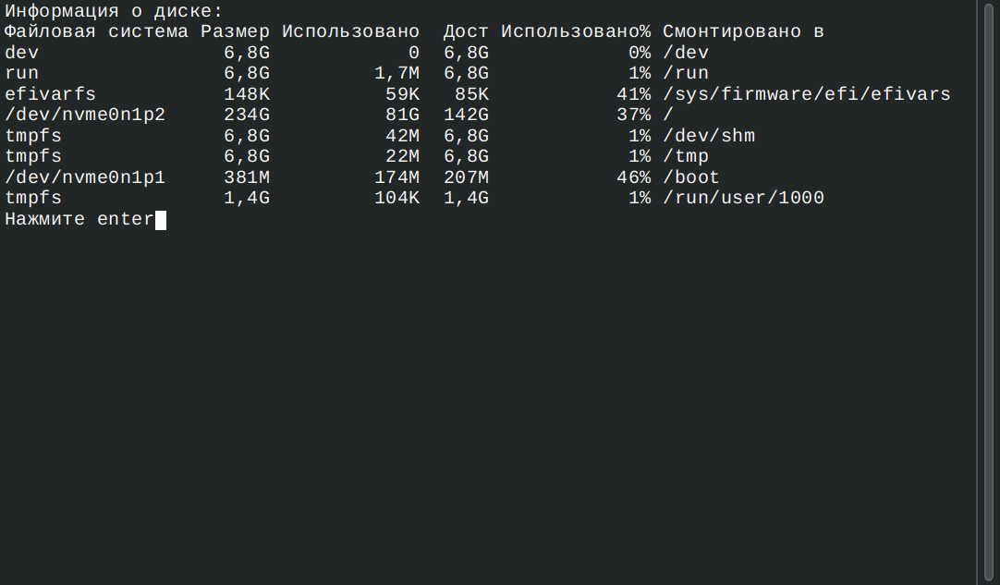
10. Информация о CPU
    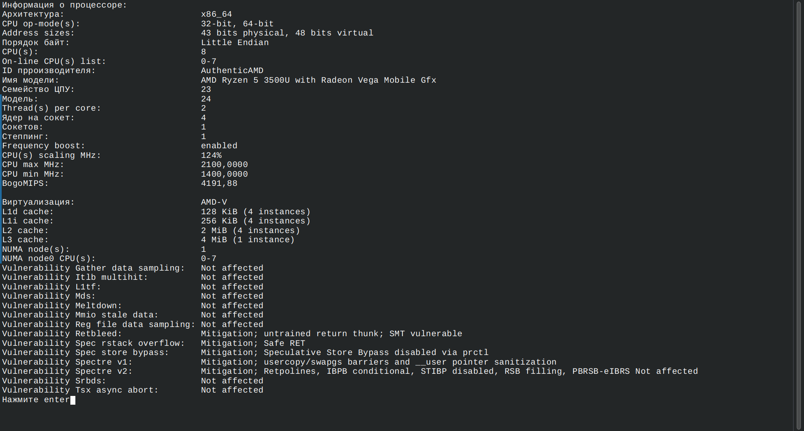
11. Информация об ОЗУ
    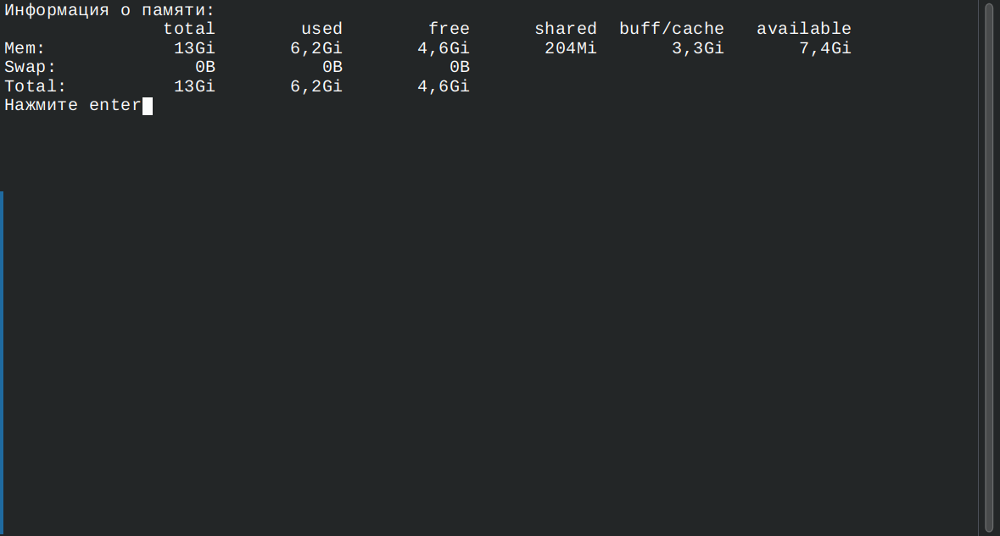
12. Информация о файловой системе
    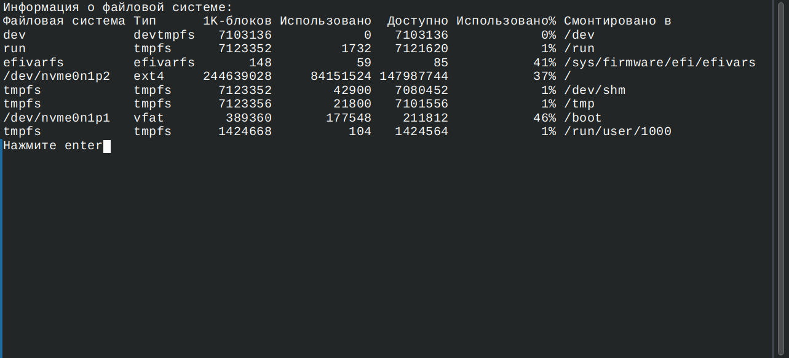
13. Установленные в системе пакеты
    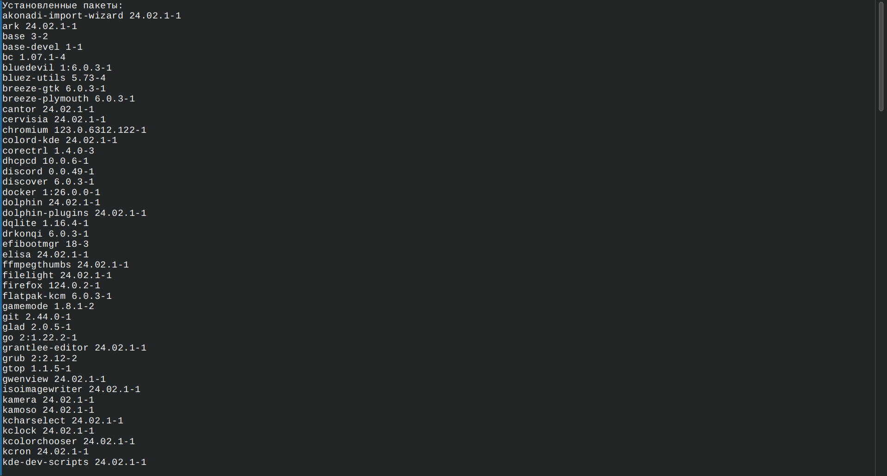
