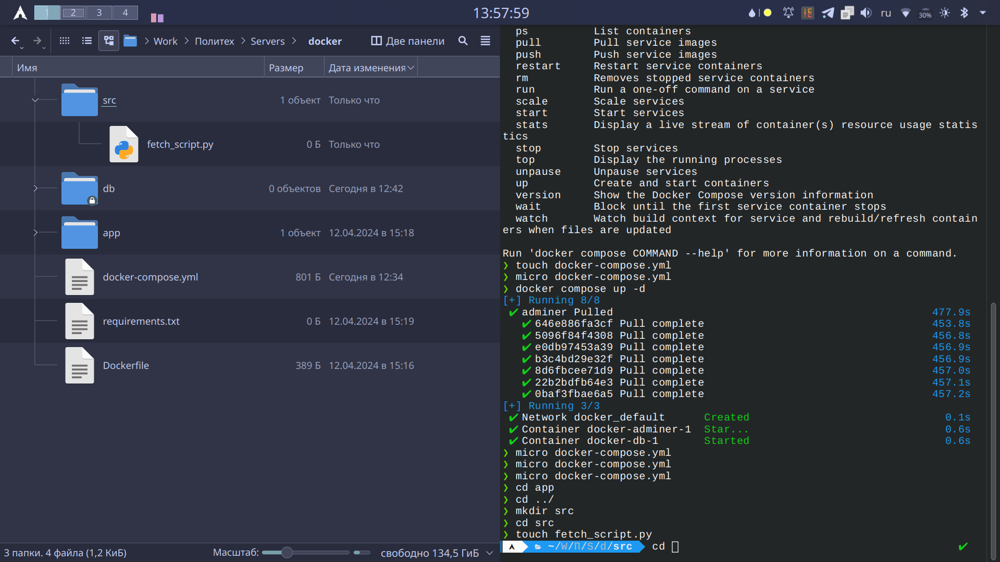

# Знакомство с docker

Начальный compose файл:

```
# 1. Создать новую папку под проект
# 2. Установить docker compose: sudo apt install docker-compose
# 3. Создать этот docker-compose.yml
# 4. Создать подпапку db
# 5. Выполнить docker compose up -d
# 6. Открыть в брОузере localhost:8080 — должна появиться веб-админка БД
# 7. Войти в админку под юзером postgres и паролем example

# Use postgres/example user/password credentials

services:

  db:
    image: postgres
    # set shared memory limit when using docker-compose
    shm_size: 128mb
    volumes:
      - ./db:/var/lib/postgresql/data
    environment:
      POSTGRES_PASSWORD: example

  adminer:
    image: adminer
    ports:
      - 8080:8080
```

> Нужно применить `docker-compose up -d` для создания контейнера с постгресом и админкой для него.

## Создание нового собственного образа

Суть в том, чтобы из скрипта на питоне подключиться к запущенной в докере БД и получить от туда какие-то данные.

1. В админке создаем новую БД:
   
2. Создаем в ней новую таблицу:
   
   
3. Создать новую запись:
   
4. Создать папку src в проекте и в ней python скрипт:
   
5. Записать в скрипт:

   ```python
    import psycopg2

    db_config = {
        "host":     "db",
        "database": "mydb",
        "user":     "manager",
        "password": "12345678",
    }

    def get_data():
        """ Retrieve data from the vendors table """
        try:
            with psycopg2.connect(**db_config) as conn:
                with conn.cursor() as cur:
                    cur.execute("SELECT * FROM students")
                    rows = cur.fetchall()

                    print("The number of rows: ", cur.rowcount)
                    for row in rows:
                        print(row)

        except (Exception, psycopg2.DatabaseError) as error:
            print(error)

    if __name__ == '__main__':
        get_data()
   ```

6. Создать отдельную папку для наших образов и создаем там докер файл:
   
7. В этой же папке нужно создать файл `requirements.txt` и записываем в него:
   ```
   psycopg2
   ```
8. редактируем файл Dockerfile в папке images/front:

   ```
   FROM python:3

   WORKDIR /usr/src

   COPY requirements.txt ./
   RUN pip install --no-cache-dir -r requirements.txt

   CMD [ "python", ]
   ```

9. Изменяем файл docker-compose.yml:

   ```
   # 1. Создать новую папку под проект
   # 2. Установить docker compose: sudo apt install docker-compose
   # 3. Создать этот docker-compose.yml
   # 4. Создать подпапку db
   # 5. Выполнить docker compose up -d
   # 6. Открыть в брОузере localhost:8080 — должна появиться веб-админка БД
   # 7. Войти в админку под юзером postgres и паролем example

   # Use postgres/example user/password credentials

   services:

     db:
       image: postgres
       # set shared memory limit when using docker-compose
       shm_size: 128mb
       volumes:
         - ./db:/var/lib/postgresql/data
       environment:
         POSTGRES_PASSWORD: example

     adminer:
       image: adminer
       ports:
         - 8080:8080

     front:
       build: images/front
       volumes:
         - ./src:/usr/src
       command:
         - python3
         - /usr/src/fetch_script.py
   ```

10. Конечная файловая структура проекта:
    
11. Создать нового пользователя в админке и дать ему права доступа к базе:

    ```sql
    create role manager password '12345678';
    alter role manager with login;
    grant all privileges on database mydb to manager;
    alter table students owner to manager;
    ```

12. Запускаем контейнер с базой данных: `docker compose up -d`
13. Запускаем контейнер со скриптом: `docker compose run --rm front`
14. Получаем следующий результат (Может отличаться в зависимости от содержания таблицы в БД):

    ```sh
    > docker compose run --rm front
    The number of rows:  2
    (1, 'Test User')
    (2, 'Pereverzev Ivan')
    ```
